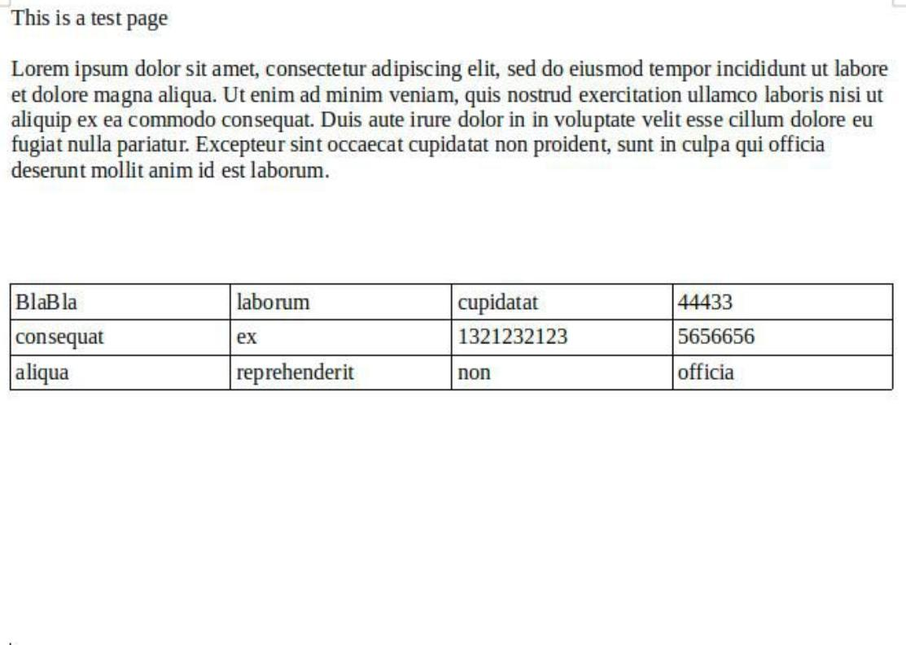
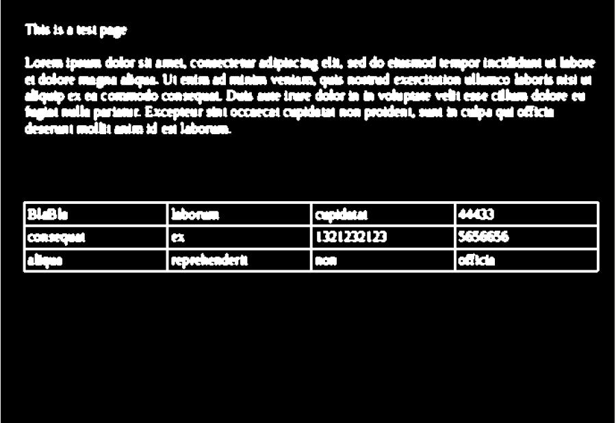
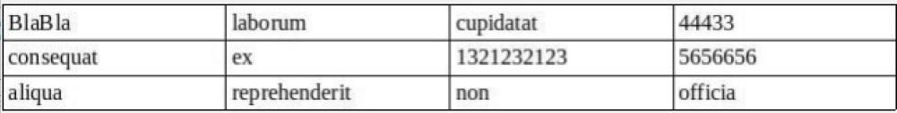
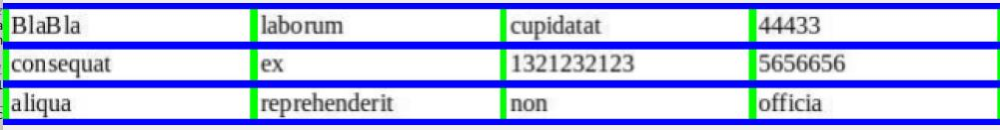
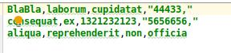

# Table data extractor into CSV from PDF of scanned images
This is a basic but usable Example of python script that allows to convert a pdf of scanned documents (images), 
extract tables from each pdf page using image processing,
and using OCR extract the table data into into one CSV file, while keeping correct table structure.

This code has quite a bit assumptions (the table is largest object in the pages),
but it can be useful to convert printed excel tables back into digital copy


### Prerequisites

install the following Packages (versions the script was developed on)

* python 3.6 
* tesseract-ocr 4.0.0
* opencv 3.4.4
* pip requirements.txt

usage:
```
python pdf-to-csv-cv.py -p test.pdf
```

this will create test.pdf.csv output file

### Algorithm


## 1. Extract image from each pdf page
   

## 2. Threshold + blur + bitwise not image:
   

## 3. find largest contour with largest area (hopefully our table), fix perspective using four point transform
   

## 4. find rows and columns, using morphological operations with custom kernels
   

## 5. use tesseract ocr, for text extraction from each cell

## 6. throw all the extracted data into one large CSV, while keeping the original table structure
   
   
## Notes
   The performance is mostly affected by the OCR package, both speed and accuracy, feel free to play with tesseract flags  

## Author
  *Vitali Mogilevsky*
  
## License
   wtfpl - see the [LICENSE](LICENSE) file for details

    
